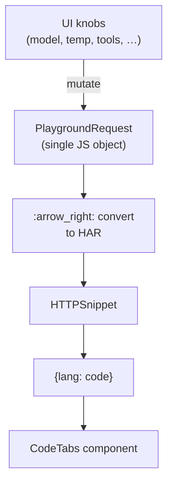

# Developer Playground – **Auto‑Generated Multi‑Language Code Snippets**
*Technical Implementation Spec*

---

## 1  Overview

The playground must turn **any request a user builds in the UI** into copy‑ready snippets (cURL, Node, Python, …) that update instantly when:

* a knob in the UI changes (model, temperature, tools, …)  
* you add new request fields or headers  
* you introduce a whole new endpoint

This approach keeps *all* request logic in one place, relies on open‑source libs for the heavy lifting, and needs **< 50 LOC** of glue code.

---

## 2  High‑Level Flow



---

## 3  Project Structure

```
src/
├─ playground/
│  ├─ PlaygroundRequest.ts      // type & helper
│  ├─ har.ts                    // request → HAR converter
│  ├─ snippet.ts                // HAR → multi‑lang snippets
│  └─ CodeTabs.tsx              // UI component
└─ …
```

---

## 4  Dependencies

| Package | Purpose | Notes |
|---------|---------|-------|
| `@openapitools/openapi-to-har` | Convert request ↔ HAR | ~8 kB gzipped |
| `@httptoolkit/httpsnippet` | HAR → cURL/Node/Python/… | ~23 kB gzipped |
| `handlebars` (optional) | SDK‑style templates | swap with Mustache/Lit if desired |
| `react-syntax-highlighter` | syntax colouring | Prism or Shiki also fine |
| `react-copy-to-clipboard` | copy button | optional |

Install:

```bash
pnpm add @openapitools/openapi-to-har @httptoolkit/httpsnippet handlebars          react-syntax-highlighter react-copy-to-clipboard
```

---

## 5  Implementation Details

### 5.1 `PlaygroundRequest` (single source of truth)

```ts
// playground/PlaygroundRequest.ts
export interface PlaygroundRequest {
  method: 'POST';
  url: '/v1/responses';
  headers: Record<string, string>; // content-type, auth, etc.
  body: any;                       // JSON built by user
}
```

*All UI widgets directly mutate an instance of this object.*

---

### 5.2 Request → HAR

```ts
// playground/har.ts
import { requestToHar } from 'openapi-to-har';
import { PlaygroundRequest } from './PlaygroundRequest';

export function toHAR(req: PlaygroundRequest) {
  return requestToHar({
    method: req.method,
    url:    `https://api.yourai.com${req.url}`,
    headers: req.headers,
    postData: {
      mimeType: 'application/json',
      text: JSON.stringify(req.body)
    }
  });
}
```

---

### 5.3 HAR → Snippets

```ts
// playground/snippet.ts
import HTTPSnippet from '@httptoolkit/httpsnippet';
import { toHAR } from './har';

export function getSnippets(req: PlaygroundRequest) {
  const snippet = new HTTPSnippet(toHAR(req));

  const code = {
    curl:   snippet.convert('shell', 'curl'),
    node:   snippet.convert('javascript', 'fetch'),
    python: snippet.convert('python', 'requests')
  };

  // Optional SDK‑flavoured Python
  const pythonTpl = `
from openai import OpenAI
client = OpenAI(api_key="{{API_KEY}}")

response = client.responses.create(
{{body}}
)
`;
  code.python = pythonTpl.replace(
    '{{body}}',
    JSON.stringify(req.body, null, 2)
  );

  return code;
}
```

---

### 5.4 UI Component

```tsx
// playground/CodeTabs.tsx
import { getSnippets } from './snippet';
import { CopyToClipboard } from 'react-copy-to-clipboard';
import { Prism as Syntax } from 'react-syntax-highlighter';

export const CodeTabs = ({ req }) => {
  const [lang, setLang] = useState<'curl'|'node'|'python'>('curl');
  const code = useMemo(() => getSnippets(req), [req]);

  return (
    <>
      <nav>
        {Object.keys(code).map(l => (
          <button key={l}
                  onClick={() => setLang(l as any)}
                  className={l === lang ? 'active' : ''}>
            {l}
          </button>
        ))}
      </nav>

      <Syntax language={lang}>{code[lang]}</Syntax>

      <CopyToClipboard text={code[lang]}>
        <button>Copy</button>
      </CopyToClipboard>
    </>
  );
};
```

Component re‑renders whenever **`req`** changes → snippets are always current.

---

## 6  Extensibility Cheatsheet

| Future change | Action required | Why it *just works* |
|---------------|-----------------|---------------------|
| Add header `OpenAI-Buddy: true` | UI mutates `headers` | HAR & snippets pick it up automatically |
| Add field `stream: true` | UI mutates `body` | JSON stringify → HAR → code |
| New endpoint `/v1/chat` | UI sets `url` | Same pipeline |
| Support Ruby snippets | `ruby: snippet.convert('ruby')` | HTTPSnippet already knows Ruby |

---

## 7  Edge‑Case Handling

* **Auth placeholder** – leave API key as `{{OPENAI_API_KEY}}`; don’t inject real user keys.
* **Large payloads** – format with `JSON.stringify(body, null, 2)` for readability.
* **Binary uploads** – set `postData.mimeType` properly so cURL uses `--data-binary`.

---

## 8  Quality Gates

| Check | Tool |
|-------|------|
| TypeScript compiles | `tsc --noEmit` |
| Snippet matches HAR | Jest: convert HAR → snippet → snapshot |
| Copy‑paste smoke test | Cypress: paste Python snippet into dockerised venv & run |

---

## 9  Reference Links

* HTTPSnippet – <https://github.com/httptoolkit/httpsnippet>  
* openapi‑to‑har – <https://github.com/openapitools/openapi-to-postman>  
* Prism themes – <https://prismjs.com/>

---

### ✅ Deliverable

Wire `CodeTabs` into the playground sidebar. Developers will always have **live, multi‑language snippets** that stay correct with every API evolution.
